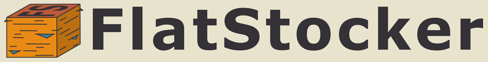
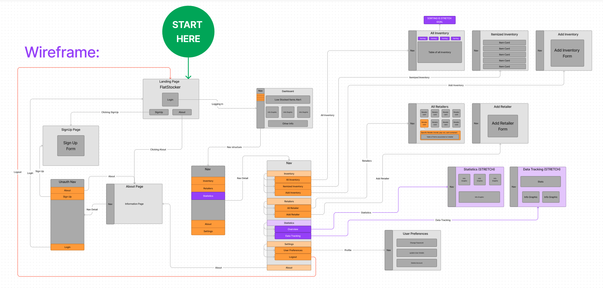
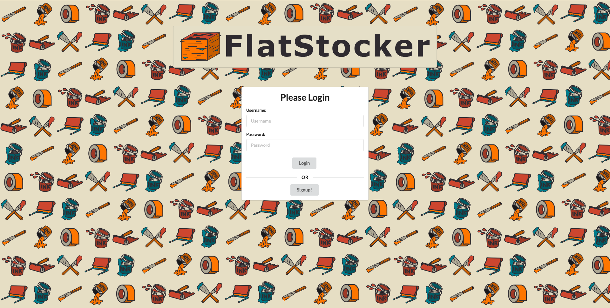
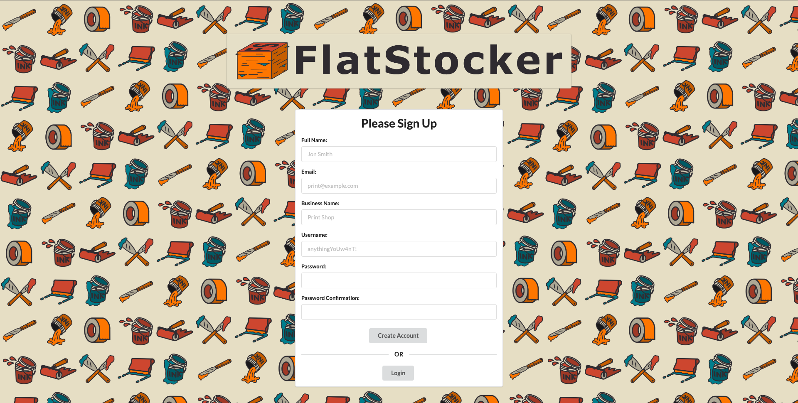
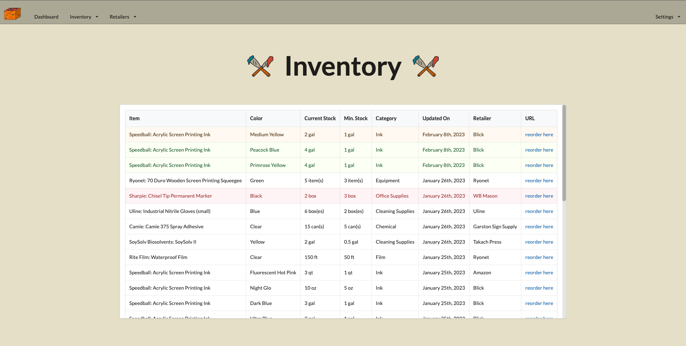
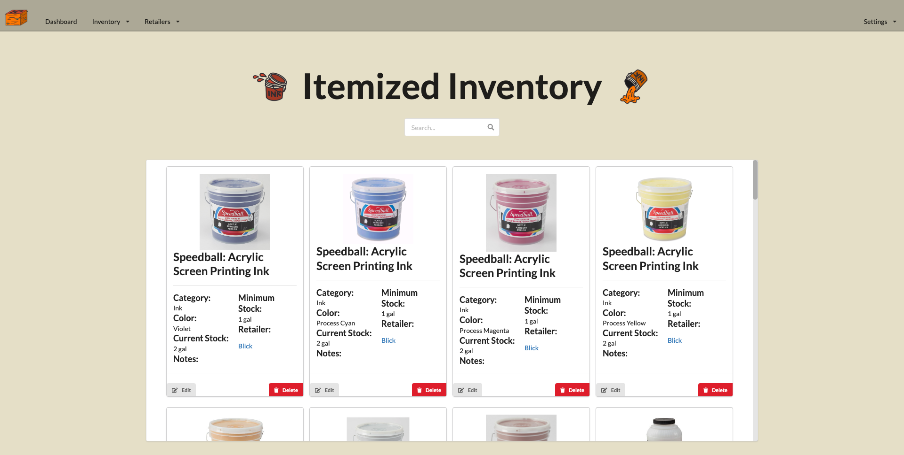
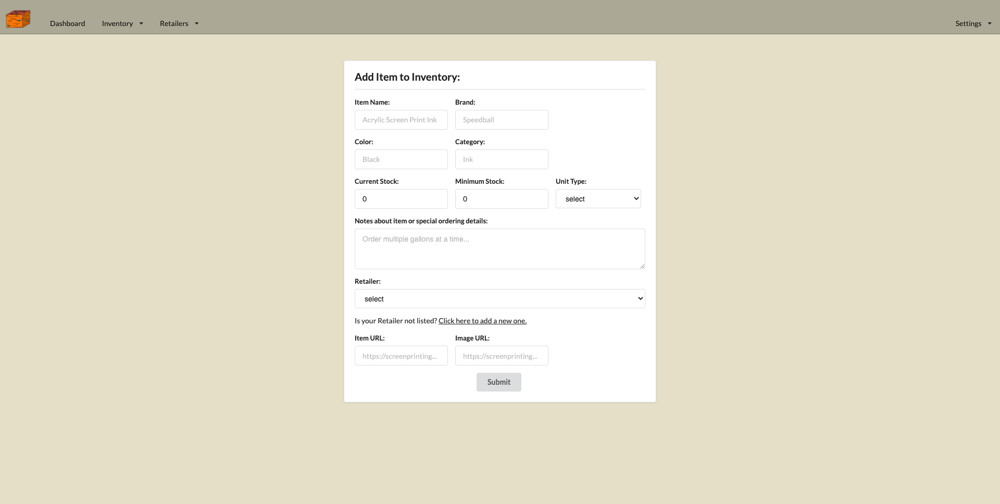
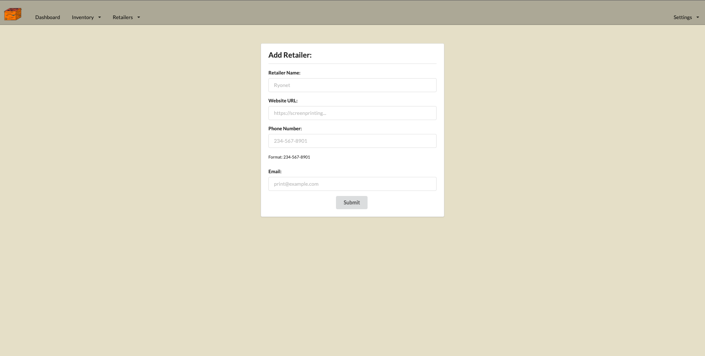
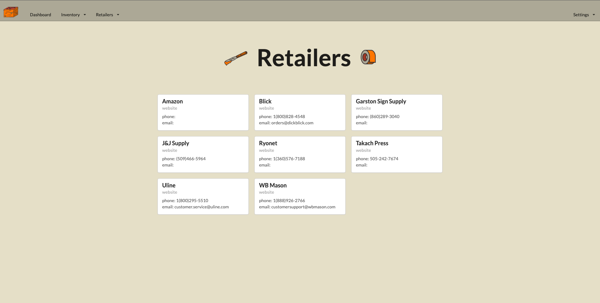
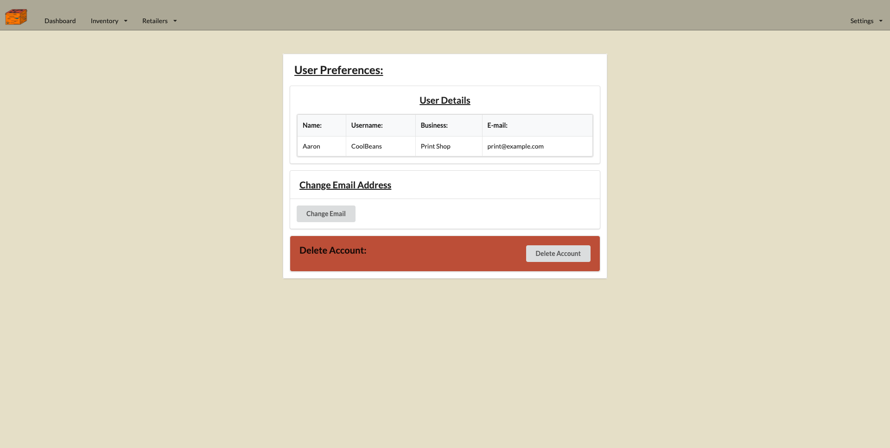

# FlatStocker

> **Languages:** JavaScript | Ruby | HTML5 | CSS

> **Frameworks:** React.js | Ruby on Rails

> **Libraries:** React Router | Semantic UI

**FlatStocker** is a full-stack inventory management web application capstone project designed by Aaron David during his last phase (3 weeks) in Flatiron School’s Software Engineering Bootcamp. FlatStocker utilizes React.js on the front-end and Ruby on Rails on the back-end. Additional front-end libraries involved in the project include Semantic UI and React Router.  

**Technical demonstrations within the application:**
- Utilized MVC (Model–view–controller) architectural pattern to develop user interface

- RESTful API conventions

- Create, Read, Update and Delete actions facilitated on the front-end and harnessed on the back-end for User and Item Models

- Create and Read actions facilitated on the front-end and harnessed on the back-end for Retailer Model

- Utilized multiple has-many, belongs-to, and has-many-through Model relationships

- User authentication & authorization with password encryption in the back-end and front-end login/logout system utilizing Sessions

- Custom back-end routes 

- Custom Controller actions & Model methods

- Custom Serialization of data and error handling

- User validations for creating an account and login

- Client-side routes via React Router

- Styling utilizing Semantic UI and vanilla CSS

#
**Original WireFrame Concept:**

#
**Landing Page:**

**Signup Page:**

FlatStocker was inspired by Aaron’s past profession as a Production Manager at a textile manufacturing company. The site’s theme is inspired by the printmaking technique of screen printing.

As a user of FlatStocker one will be able to add inventory and information about each item, as well as, tie each item to a retailer they input or select from a list of retailers within the database. New retailers can also be added and stored in the database to allow users to keep track of which companies they order specific items from.

The key features of the application are within its tracking capabilities.
#
**“All Inventory” Feature:**

This section of the website is based around a table system. Rows in the table are color coded to quickly convey the urgency of stock levels and whether ordering more stock is necessary. These colors are based on the current stock-level compared to the minimum stock-level that the user determines and manually adjusts.
  
**There are 4 colors:**

1. **Green:** When a row is green this indicates that the item has recently been added or the current stock-level has been updated to a quantity above the warning-level or minimum stock-level range.

2. **Yellow:** When a row is yellow this indicates that the item’s current stock-level is near its minimum stock-level and should be monitored for reordering in the near future.

3. **Red:** When a row is red this indicates that the item’s current stock-level has hit or gone below the minimum stock-level set by the user.

4. **White:** When a row is white this indicates that the item’s current stock-level is in a stable place compared to its minimum stock-level.

#

**“Itemized Inventory” Feature:**

This section of the application functions as a more in-depth tool to search, edit, update and delete specific items in your inventory. 

**"Add Inventory" Feature:**

**"Add Retailer" Feature:**

**Retailer Page:**

**User Preferences Page:**

 

